# **Procesamiento del lenguaje natural (PLN)**

## **Método Para Detectar la Similitud de Códigos de Fuente de Programas en Java en Tareas Escolares**

En este presente proyecto se pretende desarrollar un Método de Inteligencia Artificial para la detección de plagio de código fuente de programas en tareas escolares para el lenguaje de [Java](https://www.java.com/en/download/help/whatis_java.html)

### **Lenguaje de programación Python**

---

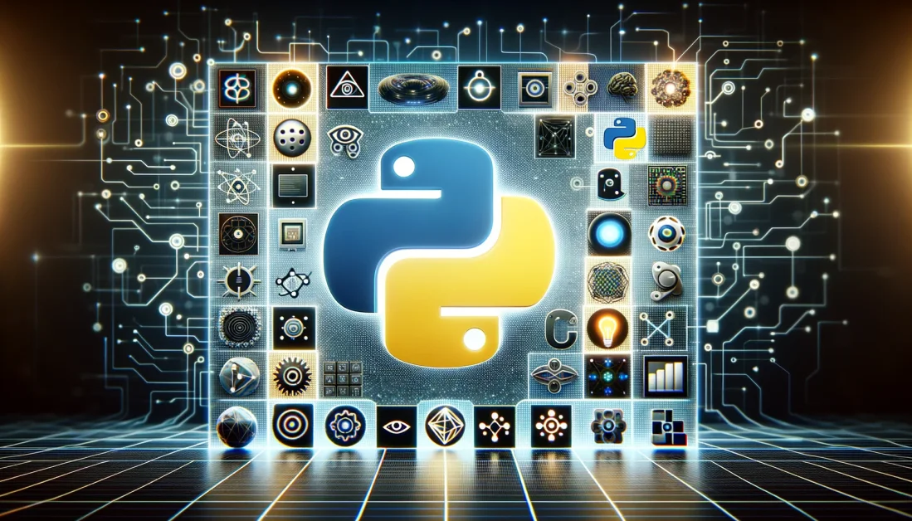

El lenguaje a utilizar para el desarrollo del Método sera el lenguaje de Python
Python es un lenguaje de programación potente y fácil de aprender. Tiene estructuras de datos de alto nivel eficientes y un simple pero efectivo sistema de programación orientado a objetos. La elegante sintaxis de Python y su tipado dinámico, junto a su naturaleza interpretada lo convierten en un lenguaje ideal para scripting y desarrollo rápido de aplicaciones en muchas áreas, para la mayoría de plataformas.

El intérprete de Python y la extensa librería estándar se encuentran disponibles libremente en código fuente y de forma binaria para la mayoría de las plataformas desde la Web de Python, [obtener Python](https://www.python.org/), y se pueden distribuir libremente. El mismo sitio también contiene distribuciones y referencias a muchos módulos libres de Python de terceros, programas, herramientas y documentación adicional.

El intérprete de Python es fácilmente extensible con funciones y tipos de datos implementados en C o C++ (u otros lenguajes que permitan ser llamados desde C). Python también es apropiado como un lenguaje para extender aplicaciones modificables. [Python Software Foundation](https://docs.python.org/es/3/tutorial/).

### **Instalación de Python**

Descargar el interprete de Python [descarga](https://www.python.org/downloads/), en el botón de descarga es la version actual al momento la versión 3.11.3 para el sistema operativo Windows en x64
**x64:** es el tipo de arquitectura con el cual cuenta nuestro equipo de computo, el cual se puede saber haciendo un

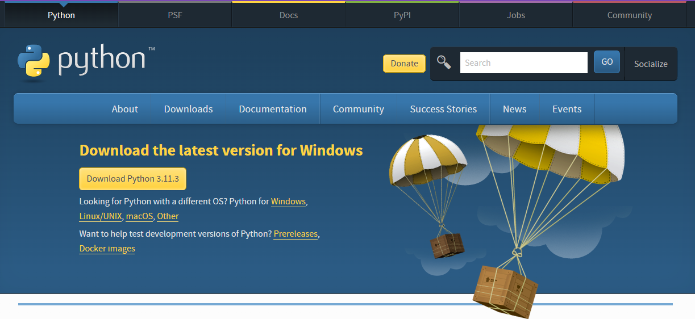

* De lo contrario si se busca una versión anterior de Python deslizando hacia abajo se puede saber presionando la tecla Windows + R, escribimos control y enter, en Sistema y seguridad, seguido de sistema, nos dará las especificaciones del sistema, sí la arquitectura del sistema es de x86 o x32 quiere decir que la version de Python 3.11.3 puede ocasionar problemas su instalación

    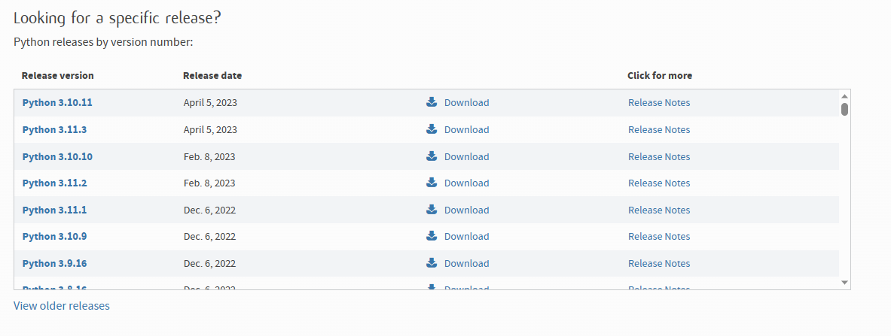

* Ya una vez descargado el archivo procedemos a darle en abrir archivo

    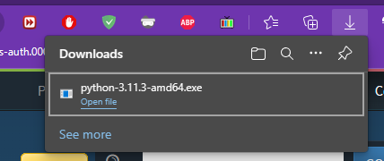

* Si aparece la siguiente ventana le decimos que instalar de todos modos (anyway)

    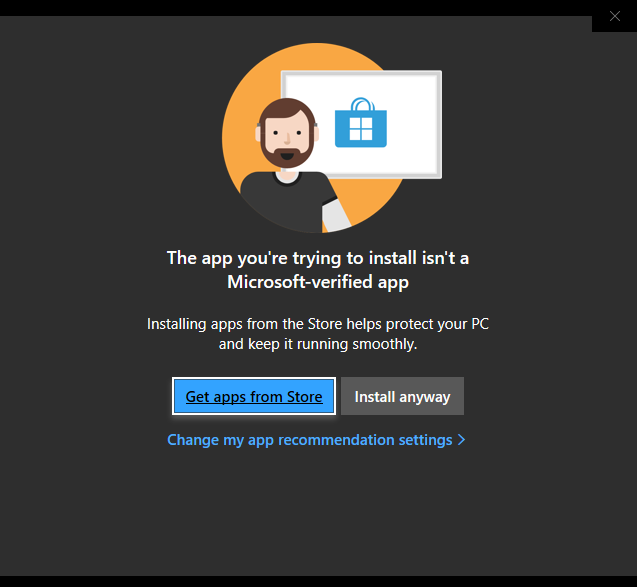

* Marcamos la casilla de agregar al path y escogemos la forma de instalación, en mí caso sera la segunda la personalizada
  
    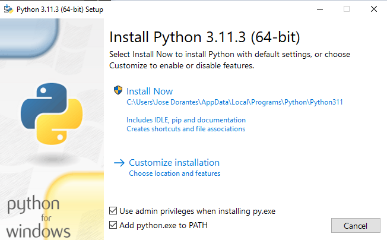

* Dejamos marcadas todas las características, en caso de estar desmarcadas marcarlas
  
    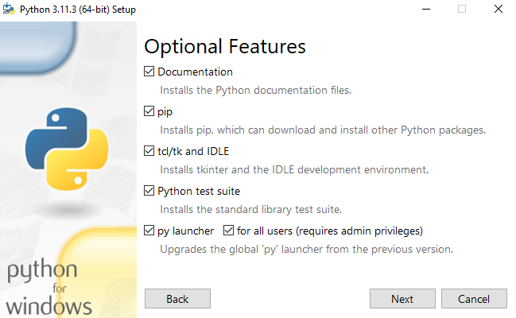

* Dejamos las opciones avanzadas asi como están, y cambiamos o no la ruta de instalación, le damos en Instalar, después nos aparecerá la ventana de permisos de administrador y le decimos que sí

    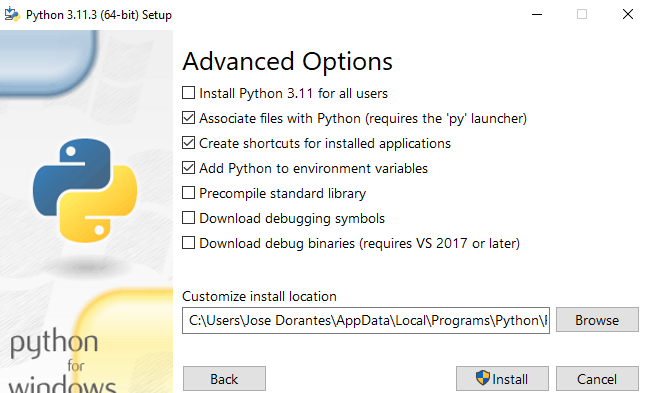

* Esperamos a que termine de instalarse

    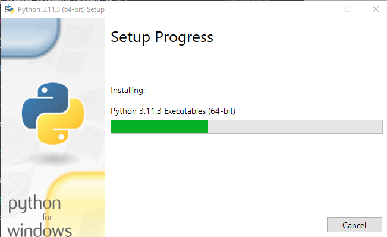

* Aquí solo le damos en cerrar

    

* Para saber que tenemos python instalado y en que versión

    ```text
    Desde el cmd Windows: python --version
    Desde un terminal Linux: python --version, python3 --version o python2 --version
    Desde MacOS: usted% python, usted% python3
    ```

    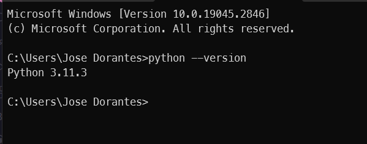

    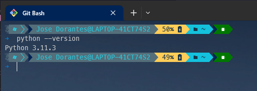

1. Para descargar e instalar Python para Linux. Normalmente Python por lo regular ya viene instalado en las distros Linux pero de lo contrario instalar con el siguiente comando desde terminal

   * Para Debian, Ubuntu, y derivados

    ```bash
    sudo apt-get install python3
    ```

   * Para RHEL, RedHat, Fedora, CentOs y derivados

    ```bash
    sudo dnf install python3
    ```

   * Para ArchLinux, Manjaro, EndeavourOS y derivados

    ```bash
    sudo pacman -Sy python-pip
    ```

2. Para hacer la instalación de Python en MacOS es mediante el siguiente comando

    ```bash
    brew install python
    ```

### **Introducción al lenguaje de Python**

---
Para poder comenzar a crear código en lenguaje Python podemos crear un archivo con la extension .py, ejemplo helloWord.py y abrirla con cualquier editor de texto como Visual Studio Code, bloc de notas, sublime text, atom, etc.

#### **Editores de texto**

un editor de texto es cualquier programa de procesamiento de texto que puedes usar para escribir y editar un texto, como Word Pad y NotePad para Windows y SimpleText y TextEdit para Mac.

Se trata de un programa informático que te permitirá editar o crear archivos digitales compuestos únicamente por textos sin formato. Es decir, archivos que no contengan formato de texto específico y que son conocidos comúnmente como archivos de texto o texto plano.

Esa es la definición general de qué es un editor de texto, pero, ahondando un poco en la  descripción del lenguaje informático, vemos que los editores de texto son programas informáticos que leen el archivo e interpretan los bytes leídos, según el código de caracteres que usa el editor, siendo común encontrar hoy en día códigos de 7 u 8 bits en ASCII o UTF-8, rara vez EBCDIC.

Los editores de texto son de gran utilidad en el área de la programación de sistemas, específicamente en el desarrollo y diseño de aplicaciones, dado que el código fuente de los programas está hecho en texto plano.

Un ejemplo de esto serían los lenguajes de codificación simples del tipo HTML y CSS, así como los script interpretados de algunos lenguajes como el lenguaje de Javascript o el lenguaje de Python, entre muchos otros lenguajes de programación empleados en el desarrollo web

1. ***Visual Studio Code:*** Actualmente, este es el principal editor de código para el desarrollo web, fue creado por Microsoft en el año 2015 y cuenta con resaltado de sintaxis, autocompletado, extensiones, soporte para la depuración y está disponible tanto para Windows, Linux, MacOS y hace poco también para la web.

    

2. ***Sublime Text:*** Fue inicialmente una extensión de Vim (otro editor de código), al igual que VS Code cuenta con extensiones, resaltado de sintaxis, está disponible para Windows, Linux y MacOS. Cuando lo descargas cuentas con una prueba para que lo evalúes de forma gratuita para, luego, comprar su licencia

    

3. ***Vim:*** Vim es un editor de código un tanto peculiar, ya que no se ejecuta de manera visual, sino directamente en la terminal. Fue creado en 1991 y cuenta con resaltado de sintaxis, autocompletado y extensiones. Esta disponible para Windows, Linux y MacOS.

    

4. ***Brackets:*** Brackets es un editor de código web, cuenta con soporte para Linux MacOS y Windows, pero su principal fuerte es la web, fue creado por adobe en 2014.

   

5. ***Notepad++:*** Fue creado en 2003, cuenta con soporte para varios lenguajes de programación y cuenta con resaltado de sintaxis. Esta disponible para Windows, Linux y MacOS.

    

Para comenzar podemos abrir un cmd (windows) o un terminal (Linux, MacOS). Sí en Linux o MacOs la palabra de ejecución es (python3 o python) sera la que usaremos para ejecutar el interprete de python desde consola, para windows es python

* windows

    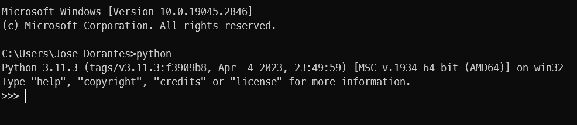

* Linux

    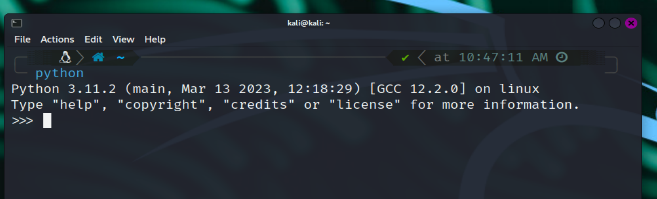

Cómo podemos notar en ambos nos asigna un prompt (>>>), a continuación podemos escribir como escribir un Hola mundo, para ejecutar solo damos enter

```python
print ("Hola mundo")
```

Y como podemos observar nos muestra el hola mundo

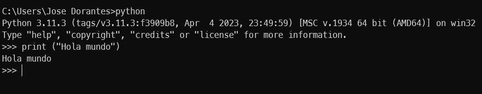

Para salir del interprete de Python escribimos exit() y enter

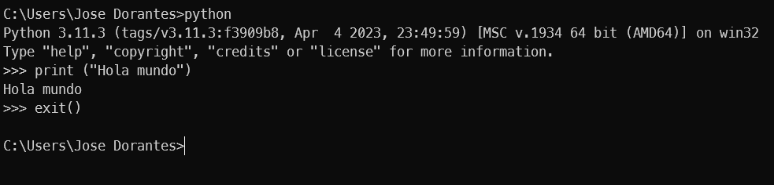

Así mismo se puede tanto para declara variables, importar módulos, etc, pero para que se tenga todo en un solo documento podemos crear uno con cualquier editor de texto o desde su IDE que al ser instalado con instala un IDE llamado IDLEñañ

#### ***IDE***

Un IDE o entorno de desarrollo integrado es una aplicación de tipo software que combina en un solo lugar todas las herramientas necesarias para realizar un proyecto de desarrollo de software. Ofrece una interfaz que permite escribir código, organizar grupos de texto y automatizar las tareas redundantes de programación.

Más que un editor de código, los IDE combinan las funcionalidades de varios procesos de programación en un mismo lugar. Poseen al menos un editor, un compilador, un desbloqueador, y las funcionalidades de complexión de código o de gestión de código genérico. Los más avanzados ofrecen también funcionalidades de [Data Visualization](https://datascientest.com/es/dataviz-definicion-objetivos-y-usos), de Tracing o de referencias cruzadas.

1. **IDLE para Python**

    IDLE es el entorno de desarrollo integrado de Python.
    IDLE tiene las siguientes características:

    * Escrito 100% en Python puro, usando el kit de herramientas GUI tkinter

    * Multiplataforma: funciona en su mayoría igual en Windows, Unix y macOS

    * La ventana del shell de Python (interprete interactivo) con coloreado de código de entrada, salida y mensajes de error

    * Editor de texto multiventana con deshacer múltiple, coloreación Python, indentado inteligente, sugerencias de llamadas a funciones, autocompletado y otras características

    * Búsqueda dentro de cualquier ventana, reemplazo dentro de las ventanas del editor, y búsqueda a través de múltiples archivos (grep)

    * Depurador con breakpoints persistentes, por pasos y visualización de espacios de nombres globales y locales

    * Configuración, navegadores y otros cuadros de diálogo

    

2. **PyCharm**

    Considerado el mejor IDE de Python para desarrolladores, PyCharm no deja piedra sin removerencanto' tú. Este producto de nivel empresarial es desarrollado por JetBrains, una empresa de software checa, que proporciona todas las herramientas que necesita para Python en un solo lugar. Tiene muchas funciones de productividad para ayudarlo a ahorrar tiempo, concentrarse en cosas más importantes y adoptar el enfoque centrado en el teclado.

    PyCharm conoce todos los aspectos de su código. Por lo tanto, puede confiar en esta solución para la verificación de errores sobre la marcha, la finalización de código inteligente, la navegación de proyectos sin esfuerzo y la rápida corrección de errores. Ayuda a los desarrolladores a escribir códigos limpios y mantenibles y a regular el control de calidad a través de comprobaciones PEP8, refactorización inteligente, inspecciones y asistencia en las pruebas.

    PyCharm tiene un editor de código inteligente que ofrece el mejor soporte de su clase no solo para Python sino también para JavaScript, TypeScript, CoffeeScript, CSS, famosos lenguajes de plantillas, Node.js, AngularJS y más. Obtiene una búsqueda inteligente si desea saltar a una clase, usos, implementación, prueba y más específicos.

    

3. **SlickEdit**

    Una empresa con sede en EE. UU., tiene más de 35 años de desarrollo con un soporte excepcional para Python. Además, admite más de 70 lenguajes de programación, edita hasta 2 TB rápidamente, es altamente personalizable, tiene un gran soporte y tiene un foro de usuarios activo.

    

4. **Spyder**

   Es un entorno científico robusto de Python diseñado para desarrolladores, científicos de datos e ingenieros. Tiene una sorprendente combinación de edición avanzada, creación de perfiles y depuración con exploración de datos, inspección profunda, hermosa visualización y ejecución interactiva.

    Spyder le permite trabajar de manera eficiente utilizando un editor en varios idiomas que tiene un navegador de clases / funciones, análisis de código, finalización automática de código, definición de acceso y división vertical / horizontal. Aproveche toda la potencia de cualquier cantidad de consolas IPython que desee dentro de su interfaz gráfica de usuario flexible.

    También puede ejecutar códigos de archivo, una línea o celular y luego hacer parcelas en línea. Modifica variables rápidamente, edita una matriz NumPy o un marco de datos, ordena colecciones, profundiza en un objeto anidado y traza series de tiempo o histogramas. Puede ver, guardar y copiar imágenes y figuras creadas durante la ejecución del código.

    Rastree todos los pasos de ejecución de su código, depúrelos de manera interactiva, vea un documento de objeto y renderícelo instantáneamente. Spyder le permite ampliar la funcionalidad utilizando complementos de terceros como Spyder Notebook, Terminal, UnitTest, Reports, etc.

    

#### **Trabajando desde el IDLE**

Presionando la tecla windows y buscando IDLE nos aparecerá el IDLE de python

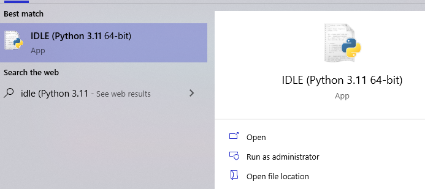

Nos aparece algo similar a lo de en terminal o cmd y como podemos notar funciona de la misma manera

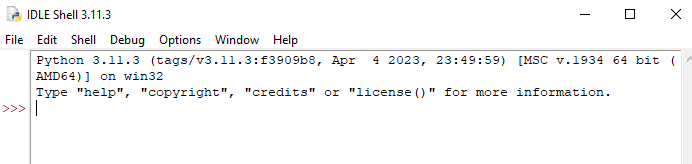
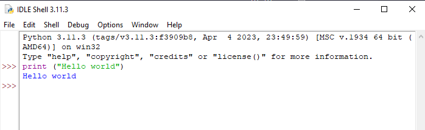

si nos dirigimos a la pestaña File o archivo y en Nuevo archivo

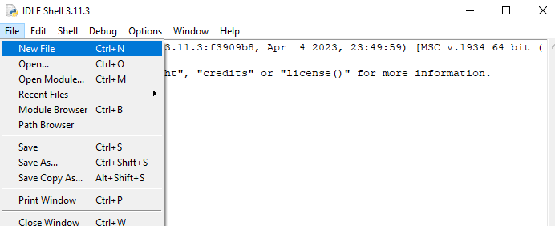

Nos aparecerá una nueva ventana, le damos en archivo y en guardar como y escogemos un nombre que queramos, de preferencia que no lleve espacios  , y le asignamos un nombre y podemos ver que cambia el nombre y la ruta del archivo

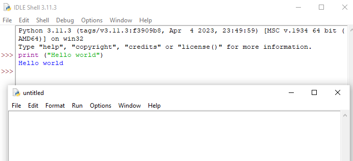

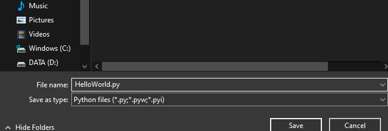

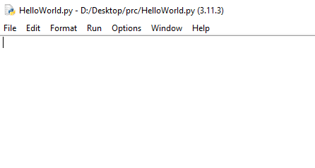

podemos escribir dentro el *print ("Hello world")* y darle en run, seguido de run module y en guardar cambios y tendremos como resultado lo siguiente

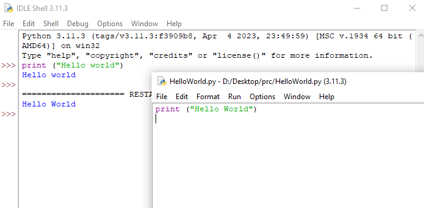

Ahora que ya se sabe como podemos crear, editar y ejecutar código en Python explicaremos los tipos de datos que existen en Python

#### ***Tipos de datos en Python***

En Python, todo valor que pueda ser asignado a una variable tiene asociado un tipo de dato. Como ya te he mencionado alguna vez, en Python todo es un objeto. Así que los tipos de datos serían las clases (donde se definen las propiedades y qué se puede hacer con ellas) y las variables serían las instancias (objetos) de los tipos de datos. No te preocupes si no entiendes qué es una clase o un objeto, lo veremos en otro tutorial.

En definitiva, un tipo de dato establece qué valores puede tomar una variable y qué operaciones se pueden realizar sobre la misma.

##### ***Números***

Los números son uno de los tipos de datos en Python. Podemos encontrarnos con números complejos, decimales o números enteros. Los números complejos se definen en Python como una “clase compleja”, mientras que los decimales se definen como “flotantes” y los enteros como “int”. Además, existe otro tipo de datos en esta categoría que se emplea para contener números largos.

* Enteros: No existe un límite máximo en el valor de los números enteros.

* Decimales: Admiten hasta 15 decimales y se usa el punto para marcar la separación.

* Complejos: x+yj, es un ejemplo de representación de número complejo en Python.

##### ***Secuencias***

En Python las secuencias son las colecciones ordenadas de distintos tipos de datos, ya sean similares o diferentes. En las secuencias podemos almacenar múltiples valores de forma organizada y eficiente.

Existen distintos tipos de secuencias:

* String: Cadenas que representan uno o varios caracteres. Básicamente se trata de una línea de texto, que se encuadra dentro de la etiqueta str

* Listas: Las listas son, fundamentalmente, lo que conocemos como arrays en otros lenguajes de programación. Es un elemento flexible ya que no es necesario que todos sus componentes sean del mismo tipo.

* Tupla: Igual que sucede con las listas, la tupla también es una colección ordenada de objetos en Python. Se diferencian en que las tuplas son inmutables, mientras que las lista se pueden modificar.

##### ***Boolean***

Solo existen dos tipos de valores para los elementos boolean en Python: verdadero o falso. En general, funcionan y son un tipo de dato que también existe en otros lenguajes de programación.

##### ***Set***

El tipo de dato Set (conjuntos) en Python se emplea para agrupar los objetos únicos y que no están ordenados. En los conjuntos en Python, los valores duplicados se eliminan y solo se conservan los valores únicos. Operaciones como intersecciones y uniones se pueden realizar entre uno o más conjuntos.[tipos de datos en Python](https://www.tokioschool.com/noticias/tipos-de-datos-python/)

#### ***Comentarios***

La capacidad de comentar el código fuente figura en todos los lenguajes de programación. Un comentario es una línea de texto no ejecutable, esto quiere decir que el compilador o intérprete no la tomará como una línea de código. Los comentarios en Python, así como en otros lenguajes de programación, sirven para dejar pequeñas explicaciones sobre qué es lo que hace el programa. Sabemos que es muy difícil recordar cada aspecto de nuestro programa, sobre todo cuando trabajamos en proyectos largos y complicados. Python, al ser un lenguaje sencillo en cuestiones de sintaxis, nos ayuda a documentar apropiadamente nuestro código sin mucho esfuerzo. Esta es una práctica necesaria y los buenos desarrolladores harán un gran uso de los comentarios. Sin esto, el código fuente puede volverse confuso realmente rápido.

En Python hacer comentarios de tres formas:

* Escribiendo el símbolo de numeral (#) al comienzo de la línea de texto donde queremos nuestro comentario.

* Escribiendo triple comillas (') al principio y al final del comentario, en este caso los comentarios pueden ocupar mas de una línea.

* Escribiendo triple comillas doble(") al principio y al final del comentario, en este caso los comentarios pueden ocupar mas de una línea.

    *código de ejemplo para todos los elementos anteriores*

```python
#Así se crea un comentario de una linea en Python
'''
Y así 
se crea un comentario
en multiples 
lineas de código. Esto nos ayuda a documentar 
bloques de código sin ser afectados
'''
"""
En python no es necesario definir el tipo de dato que usaremos 
A diferencia de C, C++, etc. que tenemos que definir los tipos de datos que usaremos y su valor, ejemplo en C++: int entero = 10;
Aquí en python solo de escribimos el valor de la variable
"""
#Tipos de datos numéricos, el símbolo de ; nos sirve si queremos escribir una nueva linea de código frente a otra, de lo contrario no afecta su presencia en python
#La palabra reservada type seguido de paréntesis y dentro en nombre de la variable, regresa el tipo de valor que es
entero = 10
decimal = 32.16
complejo = 3 + 6j
print(entero); print (type (entero))
print (decimal); print (type (decimal))
print (complejo); print (type (complejo))

#tipos de datos secuencias
#Diferentes formas de definir una cadena 
cad1 = "Hola"
cad2 = '¿Qué tal?'
cad3 = '''Hola, que tal?'''
print(cad1);print ( type (cad1))
print(cad2);  print (type (cad2))
print(cad3); print ( type (cad3))

#También podemos crear cadenas con el constructor str a partir de otros tipos de datos.
cad4=str(1)
cad5=str(2.45)
cad6=str([1,2,3])
print(cad4);  print (type (cad4))
print(cad5);  print (type (cad5))
print(cad6);  print (type (cad6))

#para crear listas se requiere de los corchetes []
lista = ['lista']
lista2 = [1, 2, 4, 6]
lista3 = ["a",1,True]
lista4 = []
print(lista);  print (type (lista))
print(lista2);  print (type (lista2))
print(lista3);  print (type (lista3))
print(lista4);  print (type (lista4))

#Tuplas en Python
tupla1 = (1, 2, 3)
print(tupla1); print(type (tupla1))

tupla2 = 1, 2, 3
print(tupla2); print(type(tupla2))

# Boolean
boolean = True
boolean2 = False
print(boolean); print(type(boolean))
print(boolean2); print(type(boolean2))

#set
# # Crea un conjunto con una serie de elementos entre llaves
# Los elementos repetidos se eliminan
dato_set = {1, 3, 2, 9, 3, 1}
print (dato_set); print(type(dato_set))

# Crea un conjunto a partir de un string
# Los caracteres repetidos se eliminan
a = set('Hola Pythonista')
print (a); print(type(a))

# Crea un conjunto a partir de una lista
# Los elementos repetidos de la lista se eliminan
solo1 = set([3, 5, 6, 1, 5])
print (solo1); print(type(solo1))


```
# Detección de Similitud de Códigos Fuente

Este código es una aplicación de detección de similitud de códigos fuente escrita en Python utilizando la biblioteca tkinter para crear una interfaz gráfica de usuario (GUI). La aplicación permite al usuario seleccionar una carpeta de archivos de entrenamiento y uno o más archivos de análisis en formato Java (.java) para compararlos con los archivos de entrenamiento. A continuación, se presenta una descripción general del código y sus principales componentes:

## Bibliotecas Importadas

El código comienza importando varias bibliotecas de Python que se utilizan a lo largo de la aplicación. Estas bibliotecas incluyen:

- `os`: Para operaciones relacionadas con el sistema operativo.
- `nltk`: Para el procesamiento del lenguaje natural (NLP).
- `tkinter`: Para crear la interfaz gráfica de usuario (GUI).
- `difflib`: Para calcular la similitud de códigos utilizando el algoritmo de diferencia.
- `matplotlib`: Para crear gráficos.
- `sklearn`: Para realizar cálculos de similitud y clustering.
- `py_stringmatching`: Para calcular la similitud de Jaccard.
- `pygments`: Para el resaltado de sintaxis de código Java.
- `datetime`: Para trabajar con fechas y horas.

## Clase `CodigoSimilaridadApp`

La clase `CodigoSimilaridadApp` es la principal de la aplicación y hereda de `tk.Tk`, lo que la convierte en una ventana de la GUI. Aquí se describen los principales métodos y funcionalidades de la clase:

### `__init__()`
El constructor de la clase configura la ventana principal de la aplicación y establece el título.

### `create_widgets()`
Este método crea los widgets (elementos de la GUI) que se mostrarán en la ventana principal, como etiquetas y botones.

### `seleccionar_carpeta_entrenamiento()`
Abre un cuadro de diálogo para que el usuario seleccione una carpeta de archivos de entrenamiento.

### `seleccionar_archivos_analisis()`
Abre un cuadro de diálogo para que el usuario seleccione uno o más archivos de análisis.

### `obtener_archivos_java(directorio)`
Recorre recursivamente un directorio y recopila todos los archivos Java (.java) que encuentra.

### `preprocesar_codigo(codigo)`
Realiza el preprocesamiento del código fuente, que incluye tokenización, eliminación de palabras vacías (stopwords) y lematización.

### `calcular_similitud_diff(codigo1, codigo2)`
Calcula la similitud de códigos utilizando el algoritmo de diferencia (difflib).

### `tokenizar_codigo(codigo)`
Tokeniza el código fuente utilizando el resaltado de sintaxis de Pygments.

### `calcular_similitud_jaccard(codigo1, codigo2)`
Calcula la similitud de Jaccard entre dos códigos fuente.

### `calcular_similitud_cosine(codigo1, codigo2)`
Calcula la similitud del coseno entre dos códigos fuente preprocesados.

### `detectar_similitud(codigo1, codigo2)`
Calcula la similitud de códigos utilizando los métodos `calcular_similitud_diff`, `calcular_similitud_jaccard` y `calcular_similitud_cosine`.

### `calcular_porcentaje_similitud(similitud)`
Convierte un valor de similitud en un porcentaje redondeado.

### `clustering(archivos)`
Realiza el clustering de los archivos utilizando TF-IDF, LDA y K-Means.

### `mostrar_similitudes_diff_grafico(resultados_similitud)`
Muestra un gráfico de barras de la similitud calculada con el algoritmo de diferencia.

### `mostrar_similitudes_jaccard_grafico(resultados_similitud)`
Muestra un gráfico de barras de la similitud de Jaccard.

### `mostrar_similitudes_cosine_grafico(resultados_similitud)`
Muestra un gráfico de barras de la similitud del coseno.

### `generar_reporte(resultados_similitud, clusters)`
Genera un archivo de reporte con los resultados de la similitud y la información de clustering.

### `mostrar_similitud_grafica(codigo1, codigo2)`
Muestra una ventana con la comparación gráfica de dos códigos fuente.

### `mostrar_siguiente_similitud()`
Muestra la siguiente similitud calculada y la comparación gráfica.

### `actualizar_estado_analisis()`
Actualiza la etiqueta que muestra el estado del análisis.

### `iniciar_analisis()`
Inicia el proceso de análisis de similitud entre los archivos de análisis y entrenamiento seleccionados.

## Ventana Principal y Ejecución

La última parte del código crea una instancia de la clase `CodigoSimilaridadApp`, configura una etiqueta para mostrar el estado del análisis y un botón para mostrar la siguiente similitud. Luego, inicia la interfaz de usuario utilizando `app.mainloop()`.

Esta aplicación proporciona una herramienta para comparar códigos fuente en busca de similitudes utilizando diferentes algoritmos y mostrar los resultados de manera gráfica y en un archivo de reporte.
