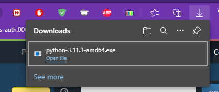
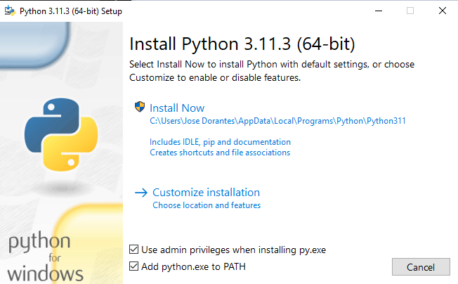
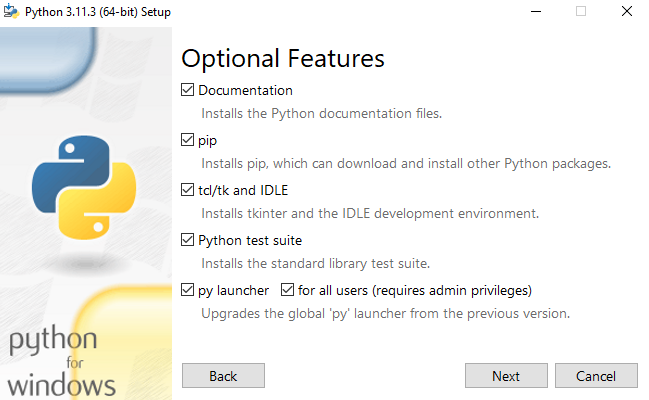
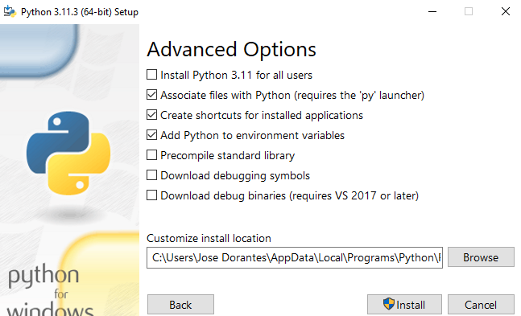
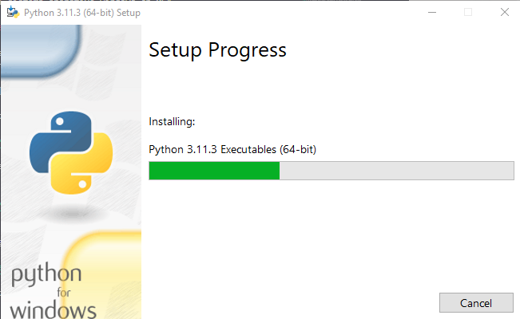
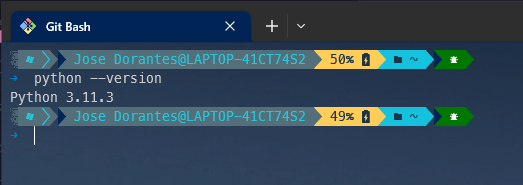
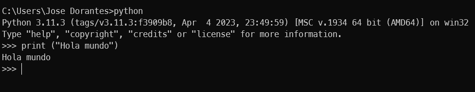
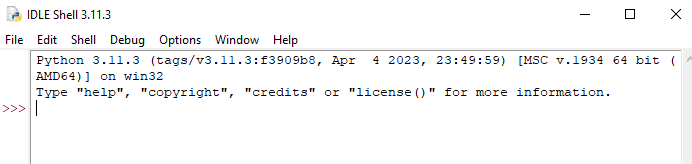
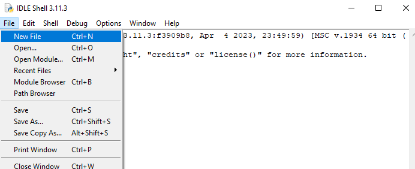

# **Natural Language Processing (NLP)**

## **Method for Detecting the Similarity of Source Code of Java Programs in School Assignments**

In this present project, we aim to develop an Artificial Intelligence Method for detecting plagiarism of source code of programs in school assignments for the [Java](https://www.java.com/en/download/help/whatis_java.html) language.

### **Python Programming Language**

---


The language to be used for the development of the Method will be Python. Python is a powerful programming language and easy to learn. It has efficient high-level data structures and a simple yet effective object-oriented programming system. Python's elegant syntax and dynamic typing, along with its interpreted nature, make it an ideal language for scripting and rapid application development in many areas, for most platforms.

The Python interpreter and the extensive standard library are available freely in source or binary form for most platforms from the Python Web, [get Python](https://www.python.org/), and can be freely distributed. The same site also contains distributions and references to many free third-party Python modules, programs, tools, and additional documentation.

The Python interpreter is easily extensible with functions and data types implemented in C or C++ (or other languages callable from C). Python is also suitable as a language for extending customizable applications. [Python Software Foundation](https://docs.python.org/es/3/tutorial/).

### **Python Installation**

Download the Python interpreter [download](https://www.python.org/downloads/), on the download button is the current version at the moment, version 3.11.3 for the Windows x64 operating system.
**x64:** is the type of architecture our computer has, which can be known by doing the following:


* Otherwise, if you are looking for an older version of Python by scrolling down, you can find out by pressing the Windows + R key, type control, and enter; in System and Security, followed by System, it will give us the system specifications. If the system architecture is x86 or x32, it means that the installation of Python 3.11.3 may cause issues.

    

* Once the file is downloaded, proceed to open the file.

    

* If the following window appears, we say to install it anyway.

    

* Check the box to add to the path and choose the installation method. In my case, it will be the second, the customized installation.
  
    

* Check all the features; if they are unchecked, check them.
  
    

* Leave the advanced options as they are, and optionally change the installation path or not, then click Install. After that, the administrator permissions window will appear, and we say yes.

    

* Wait for the installation to complete.

    

* Here, just click close.

    

* To know that we have Python installed and in which version:

    ```text
    From the Windows cmd: python --version
    From a Linux terminal: python --version, python3 --version, or python2 --version
    From MacOS: you% python, you% python3
    ```

    

    

1. To download and install Python for Linux. Python usually comes pre-installed in most Linux distros, but if not, you can install it with the following command from the terminal:

   * For Debian, Ubuntu, and derivatives:

    ```bash
    sudo apt-get install python3
    ```

   * For RHEL, RedHat, Fedora, CentOs, and derivatives:

    ```bash
    sudo dnf install python3
    ```

   * For ArchLinux, Manjaro, EndeavourOS, and derivatives:

    ```bash
    sudo pacman -Sy python-pip
    ```

2. To install Python on macOS, use the following command:

    ```bash
    brew install python
    ```
### **Introduction to Python Language**

---
To start writing code in Python, we can create a file with the .py extension, for example, helloWord.py, and open it with any text editor such as Visual Studio Code, Notepad, Sublime Text, Atom, etc.

#### **Text Editors**

A text editor is any word processing program that you can use to write and edit text, like WordPad and NotePad for Windows and SimpleText and TextEdit for Mac.

It is a computer program that will allow you to edit or create digital files composed only of plain text. In other words, files that do not contain specific text formatting and are commonly known as text files or plain text.

That is the general definition of what a text editor is, but delving a bit into the description of the computer language, we see that text editors are computer programs that read the file and interpret the bytes read according to the character code used by the editor. Nowadays, it is common to find 7 or 8-bit codes in ASCII or UTF-8, rarely EBCDIC.

Text editors are of great use in the area of systems programming, specifically in the development and design of applications since the source code of programs is made in plain text.

An example of this would be simple coding languages like HTML and CSS, as well as interpreted scripts of some languages like Javascript or Python, among many other programming languages used in web development.

1. ***Visual Studio Code:*** Currently, this is the main code editor for web development, created by Microsoft in 2015. It has syntax highlighting, auto-completion, extensions, debugging support, and is available for Windows, Linux, MacOS, and recently also for the web.

    

2. ***Sublime Text:*** It was initially an extension of Vim (another code editor). Like VS Code, it has extensions, syntax highlighting, and is available for Windows, Linux, and MacOS. When you download it, you have a trial to evaluate it for free before purchasing its license.

    

3. ***Vim:*** Vim is a somewhat peculiar code editor as it does not run visually but directly in the terminal. Created in 1991, it has syntax highlighting, auto-completion, and extensions. It is available for Windows, Linux, and MacOS.

    

4. ***Brackets:*** Brackets is a web code editor with support for Linux, MacOS, and Windows, but its main strength is the web. It was created by Adobe in 2014.

   

5. ***Notepad++:*** Created in 2003, it supports several programming languages and has syntax highlighting. It is available for Windows, Linux, and MacOS.

    

To start, we can open a cmd (Windows) or a terminal (Linux, MacOS). If in Linux or MacOS the execution word is (python3 or python), that will be what we use to run the Python interpreter from the console. For Windows, it is python.

* Windows

    

* Linux

    

As we can notice, both assign us a prompt (>>>), where we can write a "Hello World" program. To run it, just press enter.

```python```
print ("Hello World")

And as we can see, it shows "Hello World".



To exit the Python interpreter, type exit() and press enter.


You can also declare variables, import modules, etc., but to keep everything in one document, we can create one with any text editor or from its IDE which, when installed, includes an IDE called IDLE.

#### ***IDE***

An IDE or Integrated Development Environment is a software application that combines all the tools necessary to carry out a software development project in one place. It offers an interface that allows you to write code, organize text groups, and automate redundant programming tasks.

More than a code editor, IDEs combine the functionalities of several programming processes in one place. They have at least one editor, a compiler, a debugger, and code completion or generic code management functionalities. The most advanced ones also offer functionalities for [Data Visualization](https://datascientest.com/es/dataviz-definicion-objetivos-y-usos), Tracing, or cross-references.

1. **IDLE for Python**

    IDLE is Python's Integrated Development Environment.
    IDLE has the following features:

    * Written 100% in pure Python, using the tkinter GUI toolkit

    * Cross-platform: works mostly the same on Windows, Unix, and macOS

    * Python shell window (interactive interpreter) with colorizing of code input, output, and error messages

    * Multi-window text editor with multiple undo, Python colorizing, smart indent, call tips, auto completion, and other features

    * Search within any window, replace within editor windows, and search through multiple files (grep)

    * Debugger with persistent breakpoints, stepping, and viewing of global and local namespaces

    * Configuration, browsers, and other dialogs

    

2. **PyCharm**

    Considered the best Python IDE for developers, PyCharm leaves no stone unturned in its charm. This enterprise-level product is developed by JetBrains, a Czech software company, that provides all the tools you need for Python in one place. It has many productivity features to help you save time, focus on more important things, and adopt a keyboard-centric approach.

    PyCharm knows every aspect of your code. Therefore, you can rely on this solution for on-the-fly error checking, intelligent code completion, effortless project navigation, and quick error fixing. It helps developers write clean and maintainable code and regulate quality control through PEP8 checks, intelligent refactoring, inspections, and testing assistance.

    PyCharm has an intelligent code editor that offers best-in-class support not only for Python but also for JavaScript, TypeScript, CoffeeScript, CSS, popular template languages, Node.js, AngularJS, and more. You get smart search if you want to jump to a specific class, usage, implementation, test, and more.

    

3. **Spyder**

   It is a robust scientific environment for Python designed for developers, data scientists, and engineers. It has a surprising combination of advanced editing, profiling, and debugging with data exploration, deep inspection, beautiful visualization, and interactive execution.

    Spyder allows you to work efficiently using a multi-language editor with a class/function browser, code analysis, automatic code completion, access to definitions, and vertical/horizontal splitting. Leverage the full power of any number of IPython consoles you want within its flexible GUI.

    You can also run file, line, or cell codes and then make inline plots. Quickly modify variables, edit a NumPy array or DataFrame, sort collections, delve into a nested object, and plot time series or histograms. You can view, save, and copy images and figures created during code execution.

    Trace all the execution steps of your code, debug it interactively, view an object document, and render it instantly. Spyder allows you to expand functionality using third-party plugins like Spyder Notebook, Terminal, UnitTest, Reports, etc.

    

#### **Working from IDLE**

Pressing the Windows key and searching for IDLE will bring up Python's IDLE.


It appears similar to the terminal or cmd, and as we can see, it works the same way.




If we go to the File tab and then New File



A new window will appear. We go to File and Save As, choose a name we want (preferably without spaces), and assign a name. We can see that the name and path of the file change.


